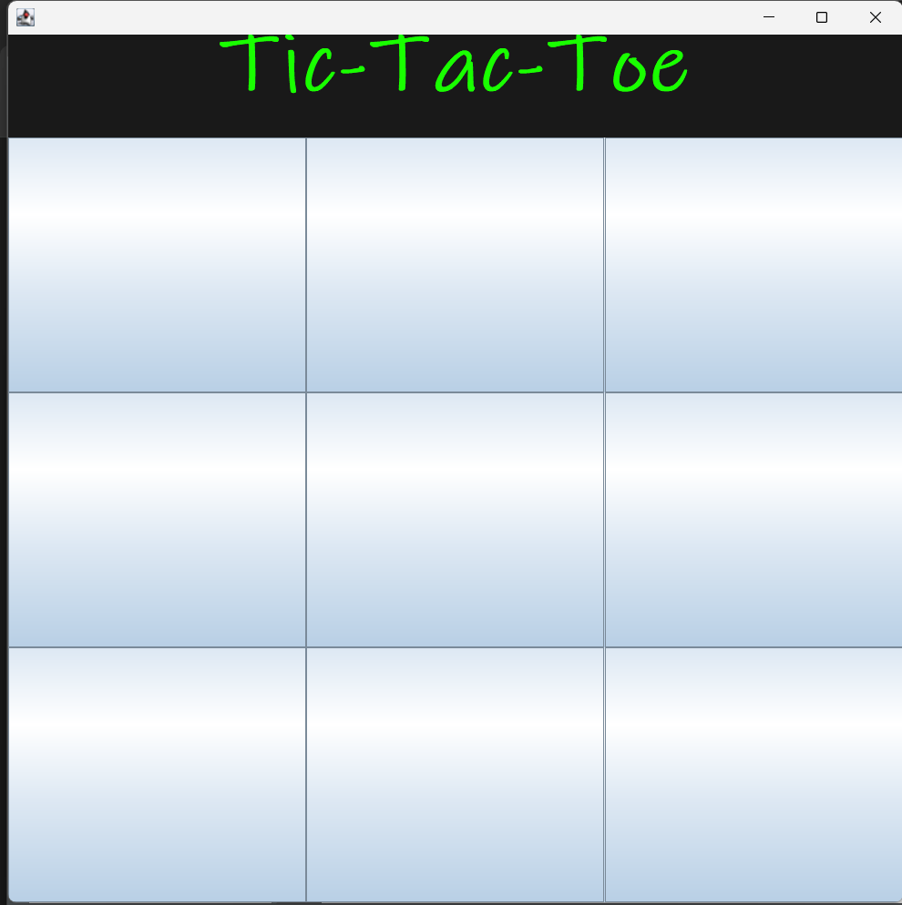

# Tic-Tac-Toe (Java Swing)

This is a Java Swing–based Tic-Tac-Toe game developed as a learning project by following a YouTube tutorial and implementing the concepts independently. The project helped me understand core Java, event-driven programming, and GUI development.

## 🎯 Project Objective
- To learn Java Swing GUI components
- To understand event handling using ActionListener
- To implement turn-based game logic
- To practice basic game state management

## 🛠️ Technologies Used
- Java (Core Java)
- Java Swing (GUI)
- AWT (Layouts, Events)

## ✨ Features
- 3×3 Tic-Tac-Toe game board
- Two-player turn-based gameplay (X and O)
- Random first turn selection
- Automatic win detection (rows, columns, diagonals)
- Visual highlight for winning combination
- Game-over state disables further moves

## 🧠 Concepts Learned
- Object-Oriented Programming (classes & objects)
- Event-driven programming 
- GUI layout management (BorderLayout, GridLayout)
- ActionListener and ActionEvent handling
- Game logic and state control

## ▶️ How to Run
1. Make sure Java is installed on your system
2. Clone this repository or download the source code
3. Compile and run the `Main.java` file
4. The Tic-Tac-Toe window will open

## 📌 Learning Note
This project was built by learning from a YouTube tutorial and rewriting the code with a clear understanding of each concept. The goal was learning and practice, not copying blindly.

## 🚀 Future Improvements
- Draw (tie) condition handling
- Restart game button
- Single-player mode with basic AI
- Code refactoring using MVC architecture

##ScreenShots

## 👤 Author
Vaitheeshwaran  
Biotechnology student learning Java and problem-solving for IT placements
  
